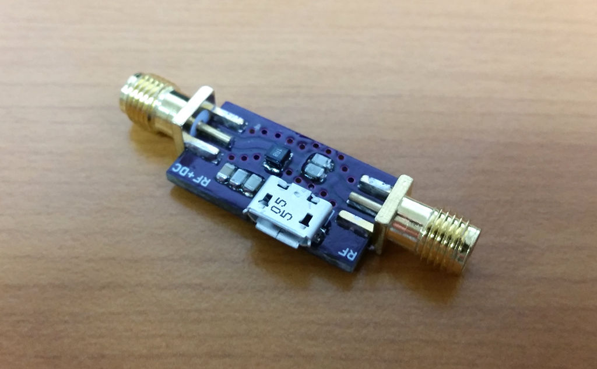

# Bias-T

[OSHPark Project](https://oshpark.com/shared_projects/qdVj57Nw)

## BOM

 - 1x [1008 1800nH](https://www.tme.eu/en/details/cw1008-1800/smd-coils/ferrocore/)
 - 2x [0805 100pF](https://www.tme.eu/en/details/cc0805jrnpo9101/0805-mlcc-smd-capacitors/yageo/cc0805jrnpo9bn101/)
 - 2x [0805 1nF](https://www.tme.eu/en/details/cc0805jrnpo9102/0805-mlcc-smd-capacitors/yageo/cc0805jrnpo9bn102/)
 - 1x [0805 10nF](https://www.tme.eu/en/details/cc0805krx7r9103/0805-mlcc-smd-capacitors/yageo/cc0805krx7r9bb103/)
 - 1x [Micro USB](https://www.tme.eu/en/details/mx-47346-0001/usb-ieee1394-connectors/molex/473460001/)
 - 2x [SMA](https://www.ebay.com/sch/i.html?_from=R40&_sacat=0&_nkw=sma+female+pcb+edge+mount&rt=nc&LH_BIN=1)
 - 1x [PCB](https://oshpark.com/shared_projects/qdVj57Nw)

## Other Projects

 - [2m Band Pass Filter](https://github.com/kolaCZek/2m-Band-Pass-Filter)
 - [2m/70cm Diplexer](https://github.com/kolaCZek/2m-70cm-Diplexer)
 - [FM Trap](https://github.com/kolaCZek/FM-Trap)

## License

[Apache License Version 2.0](./LICENSE)

## Donate

